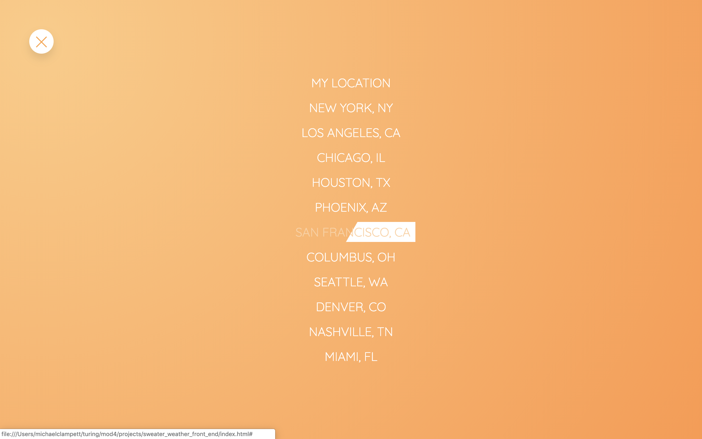

# Sweater Weather: Front End
Deployed at: https://syntheticautomation.github.io/sweater_weather_front_end/

## Project Management
Agile Board: https://waffle.io/SyntheticAutomation/sweater_weather_front_end

RIP Waffle! (May 16 2019)

## Design/Features
This project uses the following design principles & strategies:

- CSS
    - 7-1 Architecture
    - SCSS Syntax
    - Easing Functions
    - Custom Grids
    - Custom Animations

- HTML
    - BEM (Block Element Modifier) Tag Conventions

- JavaScript
    - Event Bubbling

## Tools & Technologies
- HTML5
- CSS3
- Sass/SCSS
- JavaScript
- Icons8
- [PureCSSLoader](https://loading.io/css/)
- MomentJS

## Preview

